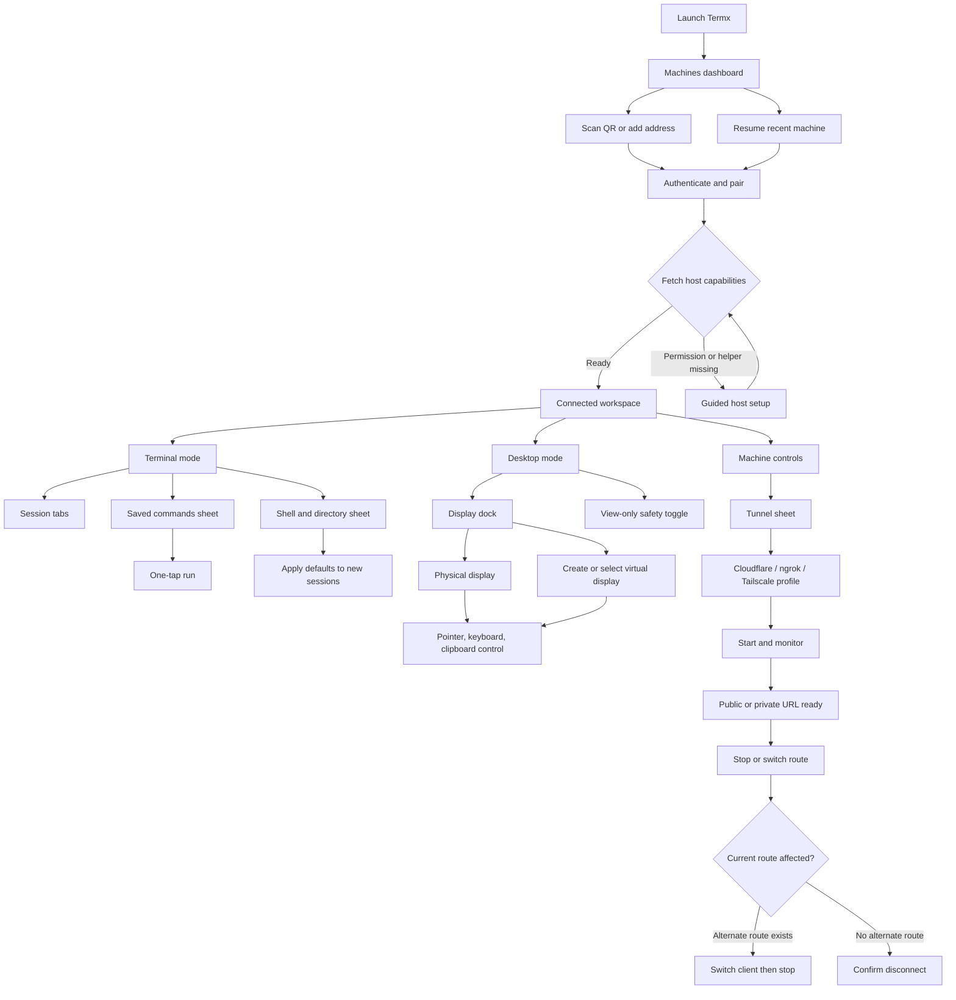

# Product UI delivery plan: remote machine control

## Approval gate
- Revision: 1
- Status: `approved`
- Scope confirmed from: user selections on 2026-09-11: macOS 13+ and Linux Wayland/X11; bundled native helpers; virtual display required; Cloudflare, ngrok, and Tailscale providers; one-tap command execution; connection dashboard, Terminal/Desktop workspace, machine-stored preferences, runtime tunnel controls, POSIX `SIGINT`, and press-and-hold backspace
- Approved revision: `1`
- Approval evidence: user message 2026-09-11: "Approved, build the specs and take files and start the implementation as planned"

## Product and UX strategy

Turn Termx from a terminal demo into a secure remote-machine workspace with three coherent layers:

1. **Home / machines:** a high-fidelity connection dashboard for discovering, adding, resuming, and understanding machine reachability. The active machine card exposes LAN and tunnel status without forcing users through a settings form.
2. **Workspace:** a persistent shell with `Terminal` and `Desktop` modes. Terminal mode retains session tabs and gains command shortcuts plus reliable mobile keys. Desktop mode provides low-latency viewing and full pointer, keyboard, clipboard, and display control. A bottom display dock switches physical or virtual displays and can create a virtual display matching the client viewport.
3. **Machine controls:** native bottom sheets on mobile and responsive drawers/dialogs on web for commands, session defaults, and tunnels. Commands, default shell, working directory, tunnel profiles, and non-secret preferences live on the connected machine so all authorized clients share them. Provider credentials live in the host OS credential store.

The smallest safe delivery is not a visual-only change. Full computer control raises the security boundary from shell access to screen capture and global input injection, so authentication, capability reporting, permission state, auditability, and transport security must be established before remote control is exposed.

Remote video should use WebRTC rather than terminal WebSockets: FastAPI carries authenticated signaling; a host media helper captures and encodes a selected display; video flows peer-to-peer when possible and through configurable TURN when required; pointer/keyboard/control messages use an ordered WebRTC data channel. Cloudflare/ngrok tunnel the HTTPS and signaling plane, while Tailscale can provide a direct private route. A tunnel alone is not assumed to relay WebRTC media.

Virtual display is a release requirement but starts with a feasibility gate because support is OS-specific:

- **macOS 13+:** a signed Swift host helper uses ScreenCaptureKit for physical-display capture and Accessibility-approved `CGEvent` input injection. The virtual-display spike must validate a supportable DriverKit/host implementation; if the required public entitlement/API is unavailable, the documented fallback is a separately signed, non-App-Store helper using the least-private viable virtual-display API with explicit compatibility checks.
- **Linux Wayland:** PipeWire/xdg-desktop-portal provides capture and RemoteDesktop portal input where available. Creating virtual outputs requires compositor adapters rather than a universal Wayland API, beginning with GNOME and KDE capability probes.
- **Linux X11:** XRandR plus a managed dummy/virtual output provides the extended display; XTest or `uinput` provides input after explicit permission setup.

Unsupported compositor or permission combinations remain visible as capability-specific setup errors, not silent fallback to a mirrored display.

## Information architecture and flow

### Navigation model

- **Mobile:** Home is a machine dashboard. A connected workspace uses a compact top machine/status bar and a thumb-reachable mode switch for Terminal and Desktop. Desktop reserves its bottom safe area for the display dock; secondary controls open in `@expo/ui/community/bottom-sheet`. Settings is reached from the machine menu rather than consuming permanent workspace space.
- **Web narrow:** match the mobile hierarchy with responsive drawers and a collapsible display dock.
- **Web wide:** use a restrained left machine rail, central Terminal/Desktop canvas, and optional right inspector for active display, tunnel, and permission details. Preserve keyboard-first navigation and full-screen desktop viewing.
- **Back and disconnect:** dismiss a sheet first, leave full screen second, return to Home third. Disconnecting from a machine never kills terminal sessions or a virtual display unless the user explicitly chooses that destructive action.

## Visual direction

Use the existing theme system in `app/src/lib/themes.ts` as the source of color truth, but replace the current stacked demo controls with an intentional remote-operations visual language:

- **Hierarchy:** compact product wordmark and machine identity, large connection state, then task-oriented cards. Use a monospaced face only for hostnames, addresses, terminal metadata, and command previews; use the platform UI face for actions and navigation.
- **Color:** retain dark-first behavior. Extend semantic tokens only for `success`, `warning`, `info`, `scrim`, and video-control chrome. Reachability and tunnel state use icon plus text, never color alone.
- **Layout:** 8-point spacing rhythm, 44-point minimum mobile targets, 12-16 point card radii, hairline borders, and low elevation. The screen stream remains visually dominant; chrome is edge-aligned and can auto-dim without becoming undiscoverable.
- **Desktop canvas:** letterbox the remote aspect ratio on a neutral black surface. Show display name, resolution, latency, and permission state in compact overlays. Display thumbnails in the bottom dock communicate physical versus virtual status and selected state.
- **Motion:** short state transitions explain connecting, dock expansion, and sheet presentation. Avoid decorative motion over the live stream and respect reduced motion. Tunnel and permission progress remains interruptible.
- **Copy:** use direct operational labels such as `Start tunnel`, `Run command`, `Create virtual display`, `Request screen permission`, and `Send Ctrl+C`. Do not expose provider logs as the primary error message; pair a plain-language recovery action with optional details.

### Mobbin-derived principles

- [Grok Bot remote desktop](https://mobbin.com/screens/675e9d35-b189-4efc-a8af-b02b91ff2205) keeps the streamed desktop dominant and moves trackpad/paste mode into progressive disclosure; Termx should similarly separate direct-touch and trackpad modes without covering the display.
- [Google TV remote](https://mobbin.com/screens/bf58e46c-b8e0-4e5c-aae1-56f74bcb7a70) provides persistent connection identity and large bottom controls around a central gesture surface; Termx should adapt that thumb reach while replacing media controls with keyboard, trackpad, display, and view-only controls.
- [Fabric actions sheet](https://mobbin.com/screens/4f0f6cdd-ddb2-4b6f-9d83-454cdddb0fb0) separates search, creation/management, and saved one-tap actions; Termx should use this hierarchy for commands while displaying an explicit immediate-run affordance.
- [Obsidian default settings](https://mobbin.com/screens/7f043fcb-4094-43ad-b377-e88ca4aa74ee) groups defaults with explanatory labels and compact pickers; Termx should use grouped rows for shell and working-directory defaults rather than the current theme-editor form density.
- [NordVPN connection sheet](https://mobbin.com/screens/4866f93d-811c-4bc1-a4b4-b4daf178f860) makes current status primary and destructive disconnect secondary; tunnel controls should follow the same state-first hierarchy.
- [Tailscale machines dashboard](https://mobbin.com/screens/4e6b5e40-1d4d-4b51-971f-49dfdd49a5e1) exposes machine identity, address, version, and last-seen status in a scannable model; the Termx web dashboard should adapt this density while mobile uses cards rather than a compressed table.

## Reuse and impact map

| Area | Existing source | Reuse / change | Risk |
| --- | --- | --- | --- |
| App shell and routes | `app/src/app/_layout.tsx`, `index.tsx`, `workspace.tsx`, `settings.tsx` | Retain Expo Router and theme provider; reshape Home and Workspace, split settings into machine-oriented sections, add setup/full-screen routes only where deep linking or back behavior requires them | Medium |
| Native surfaces | Existing `@expo/ui` and `Host` usage in `index.tsx` | Standardize command, defaults, display, and tunnel surfaces on `@expo/ui/community/bottom-sheet`; use its web drawer fallback and platform-native presentation | Medium |
| Terminal rendering | `terminal-view.native.tsx`, `terminal-view.web.tsx`, `embed.html` | Preserve xterm rendering; add focus/keyboard commands, clipboard bridge, connection state, and tests around control bytes | Medium |
| Mobile key bar | `extra-keys.tsx`, `extra-keys.web.tsx`, `lib/keys.ts` | Add dedicated interrupt and backward-delete controls; implement cancellable press-and-hold repeat with accessible alternatives | Low |
| PTY transport | `hooks/use-pty.ts`, FastAPI PTY WebSocket in `src/termx/app.py` | Version control messages; add explicit `signal` handling and reconnect-safe status rather than treating every control as text input | Medium |
| PTY lifecycle | `src/termx/sessions.py` | Establish/track a controlling terminal and foreground process group; add `SIGINT` behavior, configurable shell/cwd, and structured session defaults | High |
| Machine preferences | No host persistence exists; client storage is in `app/src/lib/storage.ts` | Add versioned, atomic host config and authenticated CRUD APIs; retain local storage only for client-specific theme and remembered connections | Medium |
| Saved commands | No existing model | Add host-owned command records with name, command, ordering, confirmation flag, and timestamps; one tap sends command plus newline | Medium |
| Tunnel manager | `src/termx/tunnel.py`, `src/termx/cli.py` | Replace one-shot Cloudflare startup with a long-lived provider manager, normalized state machine, profiles, masked secrets, log tail, start/stop/restart, and shutdown cleanup | High |
| Tunnel client UI | No existing UI/API | Add provider list, profile editor, status, URL sharing, diagnostics, and safe disconnect handoff | High |
| Remote screen transport | No existing implementation | Add authenticated WebRTC signaling, ICE configuration, stream lifecycle, control data channel, metrics, and client renderer | High |
| macOS host helper | No existing implementation | Add signed helper for ScreenCaptureKit, Accessibility input, clipboard, permission status, and virtual-display adapter | Critical |
| Linux host helper | No existing implementation | Add PipeWire portal, X11 capture/input, compositor capability probes, and GNOME/KDE/XRandR virtual-display adapters | Critical |
| Security | Shared passcode and permissive CORS in `src/termx/app.py`; passcode appears in WebSocket/query URLs | Introduce pairing/session tokens, narrow origins, one-time WebSocket/WebRTC tickets, TLS requirements for non-LAN control, credential-store integration, scope checks, and an audit trail | Critical |
| Types and API client | `app/src/lib/types.ts`, `app/src/lib/api.ts` | Add capability, preference, command, tunnel, display, stream, permission, and error contracts | Medium |
| Themes and primitives | `app/src/lib/themes.ts`, `app/src/constants/theme.ts` | Consolidate active tokens and add only missing semantic states and responsive metrics | Low |
| Packaging | `pyproject.toml`, Expo native projects, CLI startup | Package/download matching host helpers, add native WebRTC client support, surface helper/version diagnostics, and move beyond Expo Go to development/release builds | High |
| Tests | `tests/test_api.py`, `tests/test_sessions.py`; no frontend test harness | Extend Python tests and add focused component plus web end-to-end coverage; maintain OS-specific host integration fixtures | Medium |

## State matrix

| Surface | Loading | Empty | Error | Offline/disabled | Success |
| --- | --- | --- | --- | --- | --- |
| Machines Home | Skeleton machine cards and discovery indicator | Guided `Scan QR` / `Enter address` first connection | Inline connection reason with retry and edit address | Last-seen machine card, unavailable route badges | Active/recent machine card with one-tap resume and route health |
| Workspace shell | Preserve last canvas with reconnect banner | Create first terminal session automatically | Non-blocking transport banner; details and return Home | Read-only cached metadata, input disabled | Live status, machine identity, mode switch |
| Terminal | Session spinner without clearing replay | New session prompt if creation fails | Session-specific retry/kill action | Input and command run disabled | Live PTY, session tabs, shortcuts and key bar |
| Commands sheet | Row placeholders | Explain saved commands and offer `New command` | Preserve draft and retry host save | Search/read allowed from cache; Run disabled | Immediate run feedback, recent ordering, manage action |
| Defaults sheet | Shell/directory capability lookup | Host default shell and home directory shown | Invalid shell/path attached to field with recovery | Save disabled when host cannot validate | Saved-on-machine confirmation; applies to future sessions |
| Tunnel sheet | Provider-specific starting/stopping progress | Install/configure provider CTA | Normalized failure plus optional log details and retry | Missing binary/auth/route shown as setup state | Status, provider, URL, uptime, copy/share, stop/restart |
| Desktop viewer | Stream skeleton with cancel and setup progress | Select a physical display or create virtual display | Permission, encoder, ICE, helper mismatch, or capture failure with targeted action | View-only state or disconnected frozen frame clearly labeled | Low-latency stream with control mode and metrics |
| Display dock | Capability placeholders | `Create virtual display` when no eligible output exists | Per-display creation/capture error | Unsupported displays visibly disabled with reason | Selected display thumbnail, type, resolution, orientation |
| Host setup | Step progress for helper and permissions | Required capability checklist | Failed install/permission check with diagnostics | Unsupported OS/compositor explanation | Verified capture, input, virtual output, and clipboard capabilities |

## Phases

### 1. Foundation and flow shell

**1.1 Feasibility and release gates**

- Build throwaway host probes before product code for macOS virtual-display creation, GNOME Wayland virtual monitor, KDE Wayland virtual output, XRandR dummy output, ScreenCaptureKit/PipeWire capture, and input injection.
- Record an explicit capability matrix by OS version, compositor, required permission, helper privilege, API stability, and whether operation is mirror-only or extended display.
- Treat macOS virtual-display API/entitlement availability and generic Wayland fragmentation as go/no-go gates. Do not hide a failed virtual-display spike behind a UI mock.
- Benchmark one physical display and one virtual display at 1080p/30 and 1440p/60 for encode latency, bandwidth, CPU, and battery. Select codec defaults and graceful degradation from evidence.

**1.2 Security and protocol foundation**

- Version the API and define typed capability/error envelopes before adding endpoints.
- Replace reusable passcodes in URLs with passcode-based pairing that issues revocable machine-scoped client credentials, short-lived API access tokens, and one-use WebSocket/WebRTC tickets. Keep local migration for existing saved connections because those are persisted behavior.
- Restrict CORS/origins, require secure context for WAN remote control, redact secrets and URLs from logs, rate-limit pairing, and distinguish terminal, screen-view, screen-control, tunnel-admin, and settings-admin scopes.
- Add host audit events for pairing, remote-control start/stop, display creation/removal, tunnel mutations, signal delivery, and saved-command execution, without storing terminal content.

**1.3 Host state and capabilities**

- Introduce an atomic, versioned machine config under the platform application-data directory. Store shell, cwd, commands, tunnel profiles, ICE settings, virtual-display defaults, and feature preferences there; use Keychain/libsecret or protected provider files for tokens.
- Add helper discovery/version negotiation and `/api/capabilities`, `/api/permissions`, and setup-diagnostic contracts.
- Add graceful lifecycle ownership so sessions, streams, virtual displays, and provider processes are stopped or intentionally retained according to policy when Termx exits.

**1.4 High-fidelity application shell**

- Redesign `index.tsx` into responsive machine cards with reachability, route, recent activity, quick resume, QR/manual add, empty/error states, and a clear settings entry.
- Refactor `workspace.tsx` into a shared shell with Terminal/Desktop modes, stable session/stream state across mode switches, machine status, and route-aware disconnect behavior.
- Consolidate active theme primitives and remove unused Expo-starter navigation artifacts if repository usage confirms they are dead.

### 2. Core happy path

**2.1 Terminal reliability fixes**

- Establish a controlling PTY/foreground process-group model and expose a structured `signal` control message. `Ctrl+C` sends `SIGINT` to the foreground process group, never `SIGTERM`, and does not depend solely on writing a printable `^C` sequence.
- Add integration tests with a long-running child that traps `SIGINT`, plus regression tests that normal control characters and shell prompts still work.
- Add a backward-delete key that emits `0x7f`. A short press deletes once; holding begins repeat after a deliberate delay, accelerates to a bounded repeat rate, and stops on release, cancel, blur, unmount, or loss of connection. Expose a separate labeled `Clear line` action using the configured shell's standard `Ctrl+U`, rather than guessing prompt contents client-side.

**2.2 Machine-stored commands and session defaults**

- Add authenticated command CRUD and reorder APIs. Each record stores a name, exact command, optional confirmation flag, order, and timestamps. Tapping runs the command plus newline immediately; commands marked for confirmation require a second explicit action.
- Implement the searchable commands bottom sheet with pinned/recent sections, run feedback, create/edit/delete, and a manage mode. Preserve the current terminal focus after dismissal.
- Enumerate valid host shells from `/etc/shells` plus executable validation. Validate working directories by expansion, canonicalization, existence, directory type, and access; return the resolved preview before save.
- Add machine-default shell and cwd APIs plus per-new-session overrides. Existing sessions remain unchanged. Surface the active shell/cwd in session metadata so users can verify what was applied.
- Move theme-only `settings.tsx` toward grouped `Appearance`, `Terminal defaults`, `Remote control`, `Tunnels`, and `Security` sections while keeping themes client-specific as they are today.

**2.3 Runtime tunnel manager**

- Define a `TunnelProvider` interface with detect/install guidance, validate profile, start, stop, status, public URL, diagnostics, and capability flags.
- Implement Cloudflare Quick and named tunnels, ngrok agent tunnels, and Tailscale Serve/Funnel adapters as supervised subprocesses. Normalize provider output into `stopped`, `starting`, `connected`, `stopping`, and `error`; retain a bounded redacted log ring.
- Add profile CRUD and runtime endpoints with serialized mutations to prevent duplicate provider processes. Reconcile status when a provider exits externally and clean up child processes on host shutdown.
- Build the tunnel sheet with provider cards, setup/credential steps, active URL, copy/share, uptime, restart, and stop. Before stopping the route currently carrying the client, switch to a healthy LAN/alternate tunnel endpoint when possible or show an explicit disconnect confirmation.

**2.4 Physical-screen mirror and control**

- Add authenticated WebRTC offer/answer/ICE signaling and configurable STUN/TURN profiles. Add the host capture/encode pipeline, native/web receiver, reconnect, adaptive bitrate, frame-size changes, and stream metrics.
- Implement display discovery and physical-display selection. Start view-only, then request an explicit control toggle; show persistent control state and an immediate revoke action on both host and client.
- Implement pointer move/click/drag, wheel, keyboard down/up with modifier state, text input, clipboard send/receive with consent, direct-touch versus trackpad mapping, orientation changes, zoom/pan, full screen, and hardware keyboard support.
- Prevent stuck keys/buttons by sending release-all on blur, disconnect, mode switch, app background, and data-channel loss.

### 3. Alternate and failure states

**3.1 Virtual extended display**

- Add a display-service contract independent of capture: create, enumerate, resize, rotate, set scale, select, and destroy virtual displays with stable IDs and ownership leases.
- Implement the approved macOS virtual-display helper selected by Phase 1, including signed installation/update/removal, permission explanations, version checks, crash cleanup, and multi-display coordinates.
- Implement Linux adapters for GNOME Wayland, KDE Wayland, and X11/XRandR. Capability probing selects an adapter; unsupported compositors receive precise diagnostics and cannot present a false-success virtual display.
- In the display dock, distinguish physical and virtual displays, show resolution/orientation, offer `Create for this device`, and negotiate client viewport, DPR, orientation, and preferred frame rate. Allow browser full screen and native keep-awake while acting as the separate display.
- Define ownership when multiple clients connect: one control owner by default, view-only observers allowed, and explicit takeover. Virtual displays survive transient reconnect for a bounded grace period, then clean up according to the saved policy.

**3.2 Recovery and degraded operation**

- Cover denied/revoked screen-recording, Accessibility, portal, `uinput`, driver, keychain, provider-auth, and full-screen permissions with platform-specific recovery and re-check actions.
- Handle helper mismatch, helper crash, encoder fallback, no TURN route, high packet loss, suspended mobile app, changing display topology, host sleep/wake, and session/tunnel process exit.
- Preserve terminal functionality when remote-screen capabilities are unavailable. Preserve LAN access when a tunnel fails. Never let a failed optional provider block other provider profiles.
- Add destructive confirmation for removing a virtual display in use, deleting commands/profiles, killing a terminal, revoking a paired client, or stopping the only active route.

### 4. Responsive, accessibility, and motion polish

- Validate mobile portrait/landscape, tablet split view, narrow web, and wide web. Ensure the video viewport, software keyboard, terminal keys, and display dock never overlap safe areas or each other.
- Provide semantic names, roles, selected/pressed/busy states, focus restoration, logical screen-reader order, 44-point targets, visible web focus, keyboard shortcuts, and non-color status cues.
- Make desktop control operable with VoiceOver/TalkBack for chrome while documenting that the streamed remote OS has its own accessibility layer. Provide a reachable `Exit remote control` action that does not require precise gestures.
- Respect reduced motion, reduced transparency, text scaling, high contrast, and platform back/escape behavior. Disable auto-dimming controls for assistive technology users.
- Test command names, paths, provider errors, hostnames, and display labels at realistic long lengths. Avoid embedding text in thumbnails and prepare layouts for localization even if translation is not part of this scope.

### 5. Verification and handoff

- Keep a versioned protocol compatibility matrix across Expo client, Python server, and host helpers. Reject incompatible control capabilities while retaining safe terminal access.
- Produce setup and recovery documentation for macOS permissions/helper signing, Linux portal/compositor/input requirements, provider CLI/authentication, TURN configuration, and tunnel safety.
- Run security review and threat modeling before enabling non-LAN screen control by default. Include dependency/license review for codecs, native WebRTC, drivers, and provider integrations.
- Gate release on terminal regression tests, provider lifecycle tests, browser/native interaction tests, accessibility checks, host integration matrix, performance targets, reconnect/cleanup soak tests, and real-device smoke tests.
- Roll out behind separately controllable `remote_screen`, `virtual_display`, and `dynamic_tunnels` capabilities. Terminal fixes, machine defaults, saved commands, and Home redesign can ship earlier once their own gates pass.

## Test strategy

### Automated

- **Backend unit/integration:** extend `uv run pytest` for config migrations and atomic writes, shell/cwd validation, command CRUD/order/run serialization, auth scopes/tickets, tunnel provider state machines and redaction, PTY foreground `SIGINT`, helper capability mapping, WebRTC signaling authorization, and cleanup.
- **PTY regression:** launch a real interactive shell and foreground child, send structured `SIGINT`, assert the child receives it and the shell survives; verify `0x7f`, `Ctrl+U`, UTF-8, resize, reconnect replay, and concurrent subscribers.
- **Frontend unit/component:** add a repository-native React Native test harness for machine cards, state matrices, command immediate-run/confirmation, default validation, tunnel handoff warning, press-and-hold cancellation, display selection, control ownership, and permission recovery.
- **Web end-to-end:** add Playwright coverage for add/pair/resume, Terminal/Desktop switching, command CRUD/run, shell/cwd defaults, each tunnel lifecycle with fake providers, screen control input mapping, display dock, responsive breakpoints, keyboard focus, and reconnect.
- **Protocol/host fixtures:** use fake helper and fake provider executables for deterministic CI; reserve hardware/compositor tests for tagged runners.

### Host and device matrix

- macOS 13, 14, and current release on Intel where available and Apple Silicon; screen recording granted/denied/revoked; Accessibility granted/denied; one and multiple physical displays; virtual display create/resize/remove; sleep/wake.
- Ubuntu GNOME Wayland, current KDE Wayland, and Xorg; portal accepted/denied; required input permissions present/missing; virtual output adapter success/unsupported; helper restart.
- Current iOS and Android phones/tablets using development/release builds, not Expo Go, because native WebRTC is required; portrait/landscape, background/foreground, software/hardware keyboards, trackpad, and external display where available.
- Chromium, Safari, and Firefox web clients at narrow and wide widths; secure-context enforcement, full screen, pointer lock where supported, clipboard permission, and tab suspension.

### Quality targets

- No terminal input loss across a transient reconnect; `Ctrl+C` interrupts the foreground process in every supported host fixture.
- Backspace repeat starts only after the hold threshold, stops within one repeat interval on cancellation, and never continues after navigation/disconnect.
- LAN interactive stream target: p95 glass-to-glass latency under 150 ms at 1080p/30 on the reference network; degrade resolution/frame rate before input responsiveness.
- WAN stream target and TURN cost limits are recorded after Phase 1 benchmarks and must be approved before release.
- Tunnel start/stop/restart is idempotent; no orphan provider process remains after stop or host shutdown.
- Virtual displays are removed or retained exactly according to ownership policy after crashes and reconnect grace periods.
- Run `uv run pytest`, `pnpm lint`, `pnpm exec tsc --noEmit`, `pnpm export:web`, focused frontend tests, Playwright, OS helper tests, and signed-helper smoke checks before release.

## Risks

| Risk | Signal | Mitigation |
| --- | --- | --- |
| macOS virtual-display APIs may require unavailable entitlements or unstable/private APIs | Phase 1 helper cannot create a persistent extended display on macOS 13+ with acceptable signing/install behavior | Time-box the spike; prefer public DriverKit path; isolate any approved private fallback behind strict OS checks and a separately updateable helper; do not claim App Store compatibility |
| Wayland has no compositor-neutral virtual-output API | GNOME/KDE probe results or behavior diverge; other compositors expose capture but no output creation | Use explicit compositor adapters and capability reporting; document the supported matrix; keep physical mirror/control functional without mislabeling it as extended display |
| Input injection is security-sensitive and permission-heavy | Permission denial, stuck modifiers, wrong-display coordinates, or control continuing after client loss | View-only default, explicit control grant, host-visible indicator/revoke, coordinate tests, release-all safety messages, scoped tokens, and audit events |
| Current passcode/CORS design is unsafe for full remote control | Credentials appear in URLs/logs or arbitrary origins can call control APIs | Complete pairing, token, ticket, origin, TLS, rate-limit, and revocation foundation before enabling screen/tunnel administration |
| Cloudflare/ngrok HTTP tunnels do not guarantee WebRTC media reachability | Signaling connects but ICE fails on restrictive NAT | Treat tunnels as control-plane routes; support configurable TURN and Tailscale direct paths; show ICE diagnostics and view-only failure recovery |
| Stopping the active tunnel disconnects the action response/client | Client is connected through the provider being stopped | Resolve client route, attempt alternate endpoint handoff first, otherwise confirm and make stop idempotent so reconnect shows truth |
| Provider CLIs and authentication models drift | Parsing failures, changed output, expired token, externally killed process | Version detection, structured APIs where available, bounded adapters, contract fixtures, normalized errors, and provider-independent manager state |
| Bundled helper installation conflicts with Python package distribution | Missing binary, architecture mismatch, unsigned helper, privilege prompt failure | Versioned helper manifest, checksum/signature verification, guided install/update/remove, architecture-specific artifacts, and capability diagnostics |
| Native WebRTC prevents Expo Go usage | Development works on web but native module is absent in Expo Go | Move documented workflow to Expo development builds early and validate EAS/local native builds in Phase 2 |
| Remote stream consumes battery, CPU, and bandwidth | Thermal throttling, mobile battery drain, lag under 1440p/60 | Hardware encoding where supported, adaptive bitrate/FPS/resolution, metrics overlay, background suspension, and benchmark release gates |
| One-tap commands can run destructive actions accidentally | Mis-tap immediately executes an unsafe command | Show exact command preview, optional per-command confirmation, no hidden shell interpolation, clear run feedback, audit metadata, and easy edit/manage access |
| Machine defaults break session creation | Saved shell removed or cwd becomes inaccessible | Validate at save and create time, return actionable field errors, retain last valid config, and offer host shell/home reset |
| Scope is too large for one undifferentiated release | UI appears complete while native helpers or security remain unverified | Ship capability-gated vertical slices; require each phase's tests; keep virtual display behind its feasibility and OS matrix gates |
