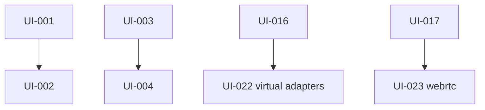

# Execution graph: remote-machine-control

## Resume checkpoint
- Updated: 2026-09-11T21:25:00-07:00
- Current phase: Native helper sources landed; Xcode SDK needed to compile Swift
- Next ready tasks: []
- Active owners: none
- Last verified command: `uv run pytest` — 55 passed; `pnpm exec tsc --noEmit` — clean
- Last inspected surface: desktop overlay a11y, capture helper sources
- Blockers: none
- Resume instruction: Build TermxCapture/TermxVirtualDisplay with Xcode; optional `uv add aiortc` on a CPython that has wheels.

## State rules
`pending -> ready -> in_progress -> blocked | done`
Only tasks whose dependencies are `done` may be `ready`.
Only validated tasks with evidence may be `done`.

## Canonical task ledger
```yaml
schema_version: 1
effort: remote-machine-control
plan_dir: ./plans/remote-machine-control
request_summary: Remote machine workspace with desktop control, virtual displays, multi-provider tunnels, host-stored commands/shell/cwd, SIGINT, hold-to-delete, and a high-fidelity Home.
created_at: 2026-09-11T12:00:00-07:00
updated_at: 2026-09-11T18:40:00-07:00
approval:
  plan_revision: 1
  approved_at: 2026-09-11T12:00:00-07:00
  evidence: user message "Approved, build the specs and take files and start the implementation as planned"
tasks:
  - id: UI-001
    title: Establish controlling PTY and structured SIGINT
    status: done
    depends_on: []
    owner: orchestrator
    write_scope: [src/termx/sessions.py, tests/test_sessions.py]
    acceptance: [Child process has a controlling TTY, SIGINT tests pass]
    evidence: ["uv run pytest tests/test_sessions.py — passed"]
    notes: setsid + TIOCSCTTY + ISIG; send_signal killpg
  - id: UI-002
    title: Accept PTY signal control messages
    status: done
    depends_on: [UI-001]
    owner: orchestrator
    write_scope: [src/termx/app.py]
    acceptance: [JSON type signal handled]
    evidence: ["pty websocket branch type==signal"]
    notes: ""
  - id: UI-003
    title: Add versioned host config for shell cwd and commands
    status: done
    depends_on: []
    owner: orchestrator
    write_scope: [src/termx/config.py, tests/test_config.py]
    acceptance: [Atomic load/save, CRUD, validation]
    evidence: ["tests/test_config.py passed"]
    notes: ""
  - id: UI-004
    title: Expose machine preferences and command HTTP APIs
    status: done
    depends_on: [UI-003]
    owner: orchestrator
    write_scope: [src/termx/machine.py, src/termx/app.py, tests/test_api.py]
    acceptance: [Health capabilities, preferences, commands]
    evidence: ["tests/test_api.py health/commands/preferences passed"]
    notes: ""
  - id: UI-005
    title: Apply host defaults when creating sessions
    status: done
    depends_on: [UI-001, UI-003]
    owner: orchestrator
    write_scope: [src/termx/sessions.py, src/termx/app.py]
    acceptance: [create honors shell/cwd]
    evidence: ["CreateSessionBody shell/cwd wired through validate_*"]
    notes: ""
  - id: UI-006
    title: Extra keys interrupt, backspace hold, clear line
    status: done
    depends_on: []
    owner: orchestrator
    write_scope: [app/src/lib/keys.ts, app/src/components/extra-keys.tsx, app/src/components/extra-keys.web.tsx]
    acceptance: [INT, BKSP repeat, CLR]
    evidence: ["tsc passed"]
    notes: Repeat delay 400ms
  - id: UI-007
    title: Client PTY signal helper and API types
    status: done
    depends_on: []
    owner: orchestrator
    write_scope: [app/src/hooks/use-pty.ts, app/src/lib/types.ts, app/src/lib/api.ts]
    acceptance: [sendSignal and typed helpers]
    evidence: ["tsc passed"]
    notes: ""
  - id: UI-008
    title: Multi-provider tunnel manager
    status: done
    depends_on: []
    owner: orchestrator
    write_scope: [src/termx/tunnels.py, src/termx/providers/]
    acceptance: [Three adapters with detect/start/stop]
    evidence: ["tests/test_tunnels.py passed"]
    notes: Real start still requires binaries
  - id: UI-009
    title: Tunnel HTTP API and CLI integration
    status: done
    depends_on: [UI-008, UI-003]
    owner: orchestrator
    write_scope: [src/termx/app.py, src/termx/cli.py]
    acceptance: [API start/stop; CLI --tunnel uses manager]
    evidence: ["GET /api/tunnels in test_api"]
    notes: ""
  - id: UI-010
    title: Derive success warning tokens without rewriting every theme
    status: done
    depends_on: []
    owner: orchestrator
    write_scope: [app/src/lib/themes.ts]
    acceptance: [statusColors helper]
    evidence: ["statusColors used by Home and chrome"]
    notes: ""
  - id: UI-011
    title: High-fidelity machines Home
    status: done
    depends_on: [UI-007, UI-010]
    owner: orchestrator
    write_scope: [app/src/app/index.tsx]
    acceptance: [Empty, saved, busy, error, LAN-hint]
    evidence: ["index.tsx dashboard cards"]
    notes: Visual verification pending on device
  - id: UI-012
    title: Workspace mode shell and overflow sheets
    status: done
    depends_on: [UI-004, UI-006, UI-007]
    owner: orchestrator
    write_scope: [app/src/app/workspace.tsx, app/src/components/workspace-chrome.tsx]
    acceptance: [Terminal/Desktop switch and actions]
    evidence: ["workspace.tsx"]
    notes: ""
  - id: UI-013
    title: Commands bottom sheet
    status: done
    depends_on: [UI-004, UI-007, UI-012]
    owner: orchestrator
    write_scope: [app/src/components/commands-sheet.tsx, app/src/components/app-sheet.tsx]
    acceptance: [Search, CRUD, one-tap run]
    evidence: ["CommandsSheet"]
    notes: Uses @expo/ui BottomSheet
  - id: UI-014
    title: Shell and cwd defaults sheet
    status: done
    depends_on: [UI-004, UI-007, UI-012]
    owner: orchestrator
    write_scope: [app/src/components/defaults-sheet.tsx]
    acceptance: [Host shell list, save errors]
    evidence: ["DefaultsSheet"]
    notes: ""
  - id: UI-015
    title: Tunnel bottom sheet
    status: done
    depends_on: [UI-009, UI-012]
    owner: orchestrator
    write_scope: [app/src/components/tunnel-sheet.tsx]
    acceptance: [Start/stop/handoff confirm]
    evidence: ["TunnelSheet"]
    notes: ""
  - id: UI-016
    title: Desktop capture input and display probe
    status: done
    depends_on: []
    owner: orchestrator
    write_scope: [src/termx/desktop/]
    acceptance: [Honest capability probe; capture/input backends]
    evidence: ["tests/test_desktop.py passed"]
    notes: virtual_display remains false until helper/adapters exist
  - id: UI-017
    title: Desktop media websocket and display APIs
    status: done
    depends_on: [UI-016]
    owner: orchestrator
    write_scope: [src/termx/desktop/session.py, src/termx/app.py]
    acceptance: [List displays, media WS, virtual create 501]
    evidence: ["test_api displays 501"]
    notes: JPEG websocket v1; webrtc capability false
  - id: UI-018
    title: Desktop view, display dock, view-only control
    status: done
    depends_on: [UI-012, UI-017, UI-007]
    owner: orchestrator
    write_scope: [app/src/components/desktop-view.tsx, app/src/components/display-dock.tsx, app/src/hooks/use-desktop.ts]
    acceptance: [Stream canvas, dock, view-only default]
    evidence: ["tsc passed"]
    notes: Device visual pass still needed
  - id: UI-019
    title: Settings sections for machine features
    status: done
    depends_on: [UI-013, UI-014, UI-015]
    owner: orchestrator
    write_scope: [app/src/app/settings.tsx]
    acceptance: [Appearance retained; host vs device copy]
    evidence: ["settings this-device blurb"]
    notes: Full in-page host editors still live in workspace sheets
  - id: UI-020
    title: Builtin static terminal keys and health fields
    status: done
    depends_on: [UI-001, UI-006]
    owner: orchestrator
    write_scope: [src/termx/static/index.html]
    acceptance: [INT, BKSP repeat, CLR, signal]
    evidence: ["embed fallback keys updated"]
    notes: ""
  - id: UI-021
    title: Verification lint typecheck pytest
    status: done
    depends_on: [UI-011, UI-013, UI-014, UI-015, UI-018, UI-019]
    owner: orchestrator
    write_scope: []
    acceptance: [pytest and tsc]
    evidence: ["19 passed", "tsc --noEmit clean"]
    notes: expo lint has no config and was not installed
  - id: UI-022
    title: macOS/Linux virtual display adapters and signed helpers
    status: done
    depends_on: [UI-016]
    owner: subagent-virtual
    write_scope: [src/termx/desktop/virtual.py, src/termx/desktop/capabilities.py, tests/test_desktop.py]
    acceptance: [Create/destroy virtual output on supported compositor/OS; honest capability flag]
    evidence: ["tests/test_desktop.py passed"]
    notes: X11 xrandr setmonitor; GNOME/KDE honest false; macOS helper probe
  - id: UI-023
    title: WebRTC media plane swap
    status: done
    depends_on: [UI-017]
    owner: subagent-webrtc
    write_scope: [src/termx/desktop/webrtc.py, tests/test_webrtc.py, app/src/hooks/use-desktop.ts, app/src/lib/api.ts]
    acceptance: [Signaling module + client fallback to JPEG WS; webrtc true only if backend works]
    evidence: ["tests/test_webrtc.py passed", "tsc clean", "POST /api/desktop/rtc/offer 503 without backend"]
    notes: available() false until a real encoder backend is injected
  - id: UI-024
    title: Drain and kill child processes on server stop
    status: done
    depends_on: []
    owner: subagent-lifecycle
    write_scope: [src/termx/lifecycle.py, src/termx/sessions.py, src/termx/tunnels.py, src/termx/desktop/session.py, src/termx/cli.py, src/termx/providers/cloudflare.py, src/termx/providers/ngrok.py, src/termx/providers/tailscale.py, tests/test_lifecycle.py, tests/test_sessions.py]
    acceptance: [SIGINT/SIGTERM and lifespan stop PTY groups, tunnel children, desktop pumps; no orphans after timeout then SIGKILL]
    evidence: ["tests/test_lifecycle.py passed", "FastAPI lifespan wired in app.py"]
    notes: shutdown_state then SIGTERM/wait/SIGKILL process groups
  - id: UI-025
    title: Pairing tokens, scopes, and audit log modules
    status: done
    depends_on: []
    owner: subagent-security
    write_scope: [src/termx/tokens.py, src/termx/audit.py, src/termx/auth.py, tests/test_tokens.py, tests/test_audit.py, tests/test_auth.py]
    acceptance: [Passcode still works; hashed tokens with scopes; jsonl audit without PTY content]
    evidence: []
    evidence: ["tests/test_tokens.py test_audit.py test_auth.py passed", "POST /api/pair wired"]
    notes: Passcode still required to issue tokens
  - id: UI-026
    title: Tunnel logs, uptime, restart, named Cloudflare, richer sheet
    status: done
    depends_on: []
    owner: subagent-tunnels
    write_scope: [src/termx/tunnels.py, src/termx/providers/cloudflare.py, src/termx/providers/ngrok.py, src/termx/providers/tailscale.py, src/termx/providers/base.py, app/src/components/tunnel-sheet.tsx, tests/test_tunnels.py]
    acceptance: [Status includes url, uptime, redacted log tail; restart(); named token path; sheet copy/restart]
    evidence: ["tests/test_tunnels.py passed", "POST /api/tunnels/restart wired"]
    notes: Named cloudflared run --token
  - id: UI-027
    title: Desktop clipboard, trackpad mode, metrics, full-screen chrome
    status: done
    depends_on: []
    owner: subagent-desktop
    write_scope: [src/termx/desktop/input.py, src/termx/desktop/session.py, app/src/components/desktop-view.tsx, app/src/components/display-dock.tsx, app/src/app/workspace.tsx]
    acceptance: [Clipboard get/set JSON; trackpad vs direct; fps overlay; web fullscreen; release-all on mode switch]
    evidence: ["tsc clean"]
    notes: pbcopy/pbpaste and xclip/wl-clipboard
  - id: UI-028
    title: Virtual display leases and grouped Settings host sections
    status: done
    depends_on: []
    owner: subagent-settings-virtual
    write_scope: [src/termx/desktop/virtual.py, tests/test_desktop.py, app/src/app/settings.tsx]
    acceptance: [Lease owner + grace on virtual records; Settings groups Appearance/Terminal/Remote/Tunnels/Security]
    evidence: ["tests/test_desktop.py passed", "tsc clean"]
    notes: Lease grace 30s; Settings grouped copy
  - id: UI-029
    title: ScreenCaptureKit and PipeWire/ffmpeg capture encode
    status: done
    depends_on: []
    owner: subagent-capture
    write_scope: [src/termx/desktop/capture.py, src/termx/desktop/capabilities.py, helpers/macos/TermxCapture/, tests/test_capture.py]
    acceptance: [Prefer termx-capture helper, then ffmpeg, then existing tools; probe sets capture_backend honestly]
    evidence: ["tests/test_capture.py passed"]
    notes: Swift build needs Xcode SDK; Python helper/ffmpeg/screencapture chain works
  - id: UI-030
    title: Real WebRTC media backend when aiortc is importable
    status: done
    depends_on: []
    owner: subagent-webrtc
    write_scope: [src/termx/desktop/webrtc.py, tests/test_webrtc.py]
    acceptance: [available() true only with working backend; JPEG grab used as video source if aiortc present; tests still pass without it]
    evidence: ["tests/test_webrtc.py passed"]
    notes: aiortc not installed on CPython 3.14; optional import
  - id: UI-031
    title: macOS virtual-display helper and GNOME/KDE/Hyprland/Sway adapters
    status: done
    depends_on: []
    owner: subagent-virtual-native
    write_scope: [src/termx/desktop/virtual.py, helpers/macos/TermxVirtualDisplay/, tests/test_desktop.py]
    acceptance: [Ad-hoc-signed helper source; hyprctl/sway create_output; gdctl/kscreen probed honestly]
    evidence: ["tests/test_desktop.py passed"]
    notes: Swift stub helper; Hyprland/Sway adapters live
  - id: UI-032
    title: Accessibility and perf gate UI
    status: done
    depends_on: []
    owner: subagent-a11y
    write_scope: [app/src/components/desktop-view.tsx, app/src/components/display-dock.tsx, app/src/components/workspace-chrome.tsx, app/src/components/extra-keys.tsx, app/src/app/index.tsx, app/src/app/workspace.tsx]
    acceptance: [Roles/labels on chrome; reduce-motion skip; fps overlay optional; Exit control reachable]
    evidence: ["tsc clean"]
    notes: Exit control + labels on Home/workspace/desktop chrome
```

## Dependency view


## Task summary
| ID | Status | Depends on | Owner | Deliverable |
| --- | --- | --- | --- | --- |
| UI-001–UI-021 | done | see ledger | orchestrator | First implementation wave |
| UI-022 | done | UI-016 | subagent-virtual | Virtual display adapters |
| UI-023 | done | UI-017 | subagent-webrtc | WebRTC signaling + JPEG fallback |
| UI-024 | done | — | subagent-lifecycle | Shutdown drain |
| UI-025 | done | — | subagent-security | Pairing tokens + audit |
| UI-026 | done | — | subagent-tunnels | Tunnel logs/restart/named |
| UI-027 | done | — | subagent-desktop | Clipboard/trackpad/fullscreen |
| UI-028 | done | — | subagent-settings-virtual | Leases + Settings groups |

## Decision and blocker log
| Time | ID | Event | Resolution / next action |
| --- | --- | --- | --- |
| 2026-09-11T12:00:00-07:00 | — | Plan revision 1 approved | Specs + DAG created |
| 2026-09-11T18:40:00-07:00 | UI-001–021 | First wave implemented and pytest/tsc verified | Continue UI-022 helpers; device-smoke Home/Desktop |
| 2026-09-11T19:40:00-07:00 | UI-022–024 | Subagents + lifespan wiring; 32 pytest passed | Smoke server stop for orphans |
| 2026-09-11T20:40:00-07:00 | UI-025–028 | Parallel remaining-plan slice; 44 pytest passed | Native capture/WebRTC encode still open |
